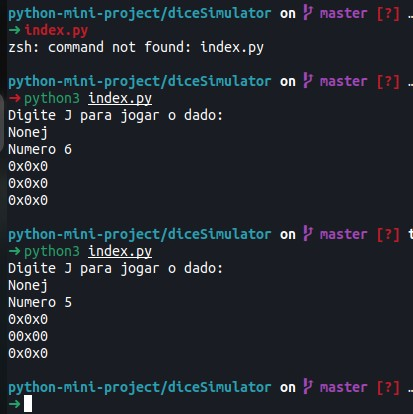

# Dice Simulator
Using the random library to randomize a number between 1 and 6.

### Prerequisites
Only import random

### How to run the script
Open the script directory in terminal and use "pythonX index.py"

### Screenshot/GIF showing the sample use of the script

## *Author Name*
<!--Remove the below lines and add yours -->
jotaelebbk
https://github.com/jotaelebbk